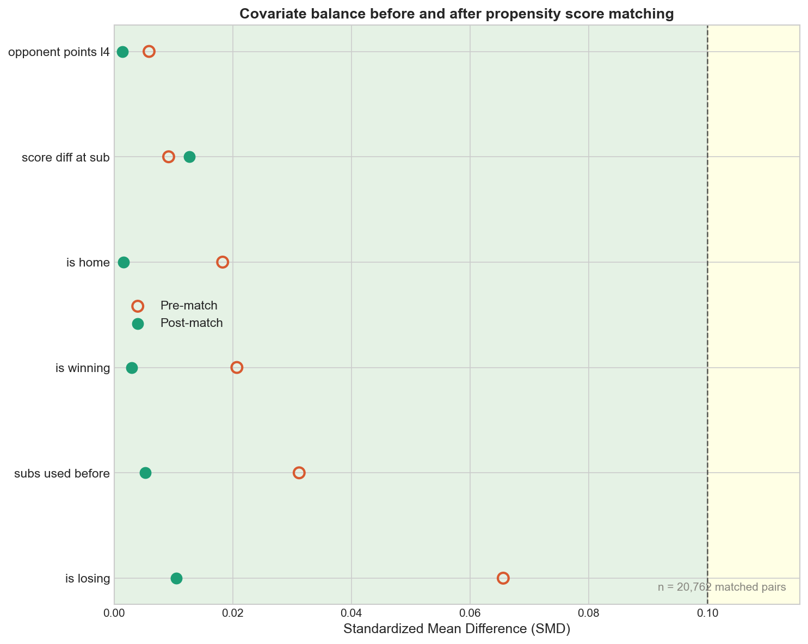
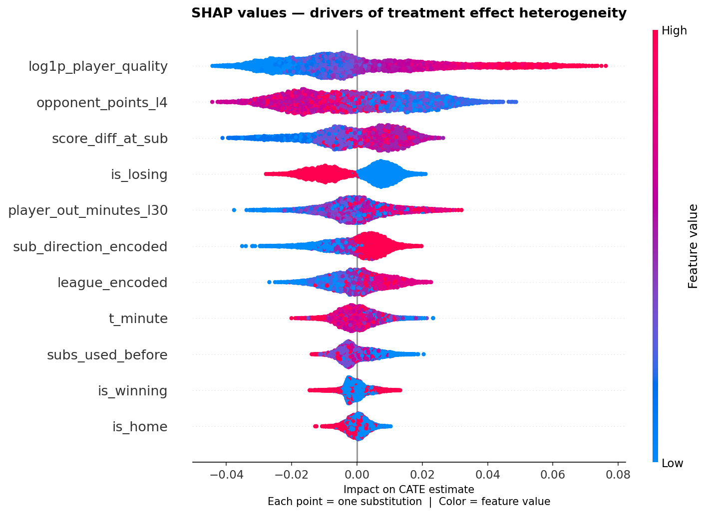
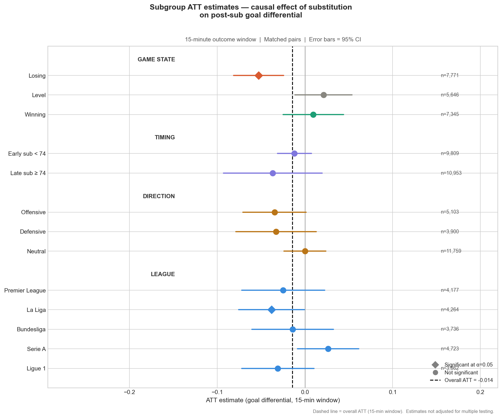

# Does Substitution Timing Win Matches?

**Finding:** Across 20,762 matched pairs in the Big 5 European leagues, substitution timing has no average causal effect on short-term goal differential. The strongest predictor of post-substitution outcomes is substitute player quality, not the minute the change is made.

---

## Research Question

Do managers who substitute earlier in a match produce better outcomes than managers who substitute later, after controlling for the game state at the moment of the decision?

## Why This Is Hard to Answer

Managers do not substitute randomly. Teams that are losing substitute earlier; teams that are winning substitute later. A raw comparison of early vs late substitutions would just measure the effect of being behind — not the effect of the timing decision itself.

This is textbook confounding. To isolate the causal effect of timing, every substitution needs to be compared against a game moment from another match — same league, same scoreline direction, similar opponent quality — where no substitution was made. Any difference in what follows can then be attributed to the substitution itself.

---

## Key Results

**Method 1 — Propensity Score Matching (primary)**
- ATT: −0.0143 goal differential
- 95% CI: [−0.033, +0.004]
- p-value: 0.125
- Significant: No

**Method 2 — Doubly Robust OLS (cross-check)**
- ATT: −0.0394
- p-value: —
- Significant: No — consistent with primary result

**Method 3 — Placebo Test (minute 30–50)**
- ATT: +0.0258
- p-value: 0.821
- Result: PASS — no spurious effect detected

**95% CI (primary):** [−0.033, +0.004] — crosses zero

**Heterogeneity:** A causal forest found meaningful variation across matched pairs (BLP slope = 1.77, p < 0.001). Only 36.9% of individual estimates were positive — the null average masks genuine situational differences.

**Top SHAP driver:** Substitute player quality (goals + assists per 90) is the strongest predictor of post-substitution outcomes across all five leagues — not timing.

---

## Visuals

**Covariate balance after matching (Love Plot)**



Every post-match standardized mean difference falls below 0.10 — the two groups are statistically comparable on all six confounders.

**SHAP Feature Importance**



Player quality sits at the top. Substitution timing does not appear among the leading drivers.

**Subgroup ATT Forest Plot**



---

## Methods Pipeline

1. **Data ingestion** — FBref via `soccerdata`: 3,585 matches, 31,545 substitution events, player season stats, match-level events across the Big 5 leagues (2022–24)
2. **Feature engineering** — 237,000-row analytical dataset; substitution classification (tactical / injury-proxy / disciplinary); control group construction (every no-sub minute 50–90)
3. **Exploratory analysis** — substitution timing distributions, confounder correlations, naive outcome visualisations; informed matching design
4. **Propensity score matching** — logistic regression propensity model; within-league nearest-neighbour matching; caliper = 0.026; 20,762 matched pairs (99.9% match rate)
5. **ATT estimation** — paired t-test (primary); doubly robust OLS with HC3 SEs (cross-check); placebo test; Rosenbaum sensitivity bounds; subgroup ATTs across 13 subgroups
6. **Causal forest + SHAP** — `econml` RegressionForest (2,000 trees) on matched pair differences; BLP and calibration heterogeneity tests; SHAP decomposition of individual CATEs

Full methodology: [docs/methodology.md](docs/methodology.md)  
Plain-English walkthrough: [docs/project_walkthrough.md](docs/project_walkthrough.md)

---

## Project Structure

```
soccer_causal/
├── src/
│   ├── ingest.py          # Phase 1 — data collection
│   ├── features.py        # Phase 2 — feature engineering
│   ├── propensity.py      # Phase 3 — propensity score matching
│   ├── estimation.py      # Phase 4 — ATT estimation and validation
│   └── causal_forest.py   # Phase 5 — causal forest and SHAP
├── notebooks/
│   └── eda.ipynb          # Exploratory data analysis
├── data/
│   ├── processed/         # Parquet files (matched pairs, model-ready dataset)
│   └── results/           # Output CSVs, plots, phase summaries
└── docs/
    ├── methodology.md     # Full statistical methodology
    └── project_walkthrough.md
```

---

## Reproducing the Analysis

```bash
pip install -r requirements.txt

python src/ingest.py        # Phase 1 — collect data
python src/features.py      # Phase 2 — build analytical dataset
python src/propensity.py    # Phase 3 — match pairs
python src/estimation.py    # Phase 4 — estimate ATT
python src/causal_forest.py # Phase 5 — causal forest + SHAP
```

Results are written to `data/results/`. Phase summaries: `phase4_summary.txt`, `phase5_summary.txt`.

---

## Limitations

- **Outcome variable:** Goal differential over 15 minutes is noisy. xG-based outcomes would be more precise but were not available so unable to incooperate it into the study.
- **Unmeasured confounders:** Rosenbaum bounds Γ = 1.00 — the estimate is sensitive to hidden confounders not captured by the six matching variables (e.g. tactical formation, pressing intensity, individual player form).
- **Two seasons:** Effect stability across different tactical eras is untested.

---

## Data

Raw data is not included in this repository (scraped from FBref via `soccerdata`). Processed parquet files are available on request. All result CSVs and figures are included in `data/results/`.
